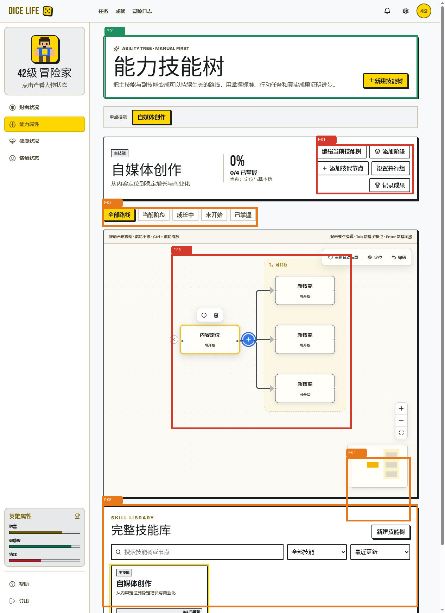

Method: dual-agent (A: `/root/impeccable_design_review` → B: `/root/impeccable_detector_audit`)

# 能力技能树模块 UI、UX 与自动化质量审计

审计日期：2026-08-02
审计对象：Dice Life 能力技能树桌面 Web 模块
主要旅程：创建技能树 → 添加阶段与节点 → 建立串行/并行关系 → 编辑、删除与撤销 → 查看详情和成果
方法：Impeccable 独立双评审、UX Audit 四遍检查、Frontend Design Audit 15 原则、Playwright 真实交互、axe-core 自动可访问性检测、源码核验。

标注颜色：绿色为正面模式；橙色为中等问题；红色为严重问题。

## 一、结论摘要

当前版本已经具备一个可用技能树编辑器的核心能力，左到右生长、同父级并行容器、自由拖拽、缩放、小地图、删除撤销和详情数据都已形成完整闭环。它不再是旧版只读图，也不是普通列表换皮。

但还不适合直接作为稳定版本发布，原因集中在四处：

1. 画布的全局快捷键会拦截整页 Tab、Enter、Delete 等按键，是键盘用户的阻断问题。
2. 画布为了展示整棵树而过度缩小节点；打开详情后问题更严重，核心内容的可读性低于控制器和小地图。
3. 页面同时承担“推进当前技能”和“管理全部技能库”，用户的默认焦点不够单一。
4. 移动端仍是压缩桌面画布，触控目标、小地图占比和节点操作方式不适合手机。

建议优先顺序：先修键盘与语义结构，再做当前阶段聚焦模式和移动端模式，随后处理选择状态同步、性能索引和视觉 token。

## 二、Playwright + axe-core 安装与使用方案

### 已安装

- `@playwright/test@1.62.1`
- `@axe-core/playwright@4.12.1`
- `axe-core@4.12.1`

项目新增：

- `playwright.config.ts`
- `src/ability/e2e/ability-canvas.spec.ts`
- `src/ability/e2e/ability-canvas.spec.ts-snapshots/parallel-branches-desktop-chrome-win32.png`
- `npm run test:e2e`
- `npm run test:e2e:ui`
- `npm run test:a11y`

配置直接调用本机 Chrome，不依赖额外下载 Playwright Chromium。此前浏览器下载超时不影响当前测试执行。

### 是否需要写测试代码

**需要。** 安装 Playwright 和 axe-core 只提供测试能力，不会自动知道技能树的业务规则。至少需要为以下契约编写测试：

- 同一父节点连续点击三次 `+`，只产生三个并行的下一层子节点；
- 删除分支后可撤销；
- 缩放、适应视图和画布移动有效；
- 跨树搜索打开节点时，节点选择和详情保持同步；
- Tab 不被画布全局拦截；
- 对话框支持 Esc、焦点圈定和关闭后焦点归还；
- 关键界面没有 axe Critical/Serious 违规。

现有 E2E 已覆盖前三项中的主流程，并建立了视觉基线；可访问性测试当前作为质量门禁暴露真实缺陷。

### CLI 还是 MCP

| 场景 | 推荐方式 | 原因 |
|---|---|---|
| 日常回归、CI、版本验收 | **Playwright Test CLI + 项目内测试代码** | 可重复、可审查、能留痕、失败可阻止发布 |
| 临时探索、视觉巡检、复现未知 Bug | Browser/MCP 辅助 | 适合人在环探索，但不应替代正式回归套件 |
| 可访问性门禁 | **CLI 中集成 axe-core** | 能持续检测 DOM 变化造成的回归 |

结论：项目正式方案选 CLI；MCP 作为探索和调试补充，不作为唯一测试连接。

### axe 当前发现

`npm run test:a11y` 当前发现两条 Critical 违规：

1. `aria-required-children`：`.ability-flow-shell[role="tree"]` 的直接结构包含 React Flow 的 `role="application"`，不符合 tree 所需子角色结构。
2. `aria-required-parent`：`.ability-flow-node[role="treeitem"]` 被 React Flow 包装后，不再处于合法的 tree/treeitem 父级结构中。

位置：`src/ability/components/AbilityTreeStage.tsx:92-97` 及 React Flow 外层结构。不要只删除 ARIA 来让测试变绿；应重新设计可聚焦的树语义，或将画布定义为 application 并提供独立、线性的可访问树视图。

## 三、Impeccable Design Health

### Nielsen 10 项评分

| # | 启发式 | 分数 | 关键问题 |
|---|---|---:|---|
| 1 | 系统状态可见性 | 3 | 有进度、选择、撤销和错误反馈；部分关系变化没有就地反馈 |
| 2 | 系统与现实世界匹配 | 3 | 阶段、技能和成果自然；“并行组、汇合、Manual First”需翻译 |
| 3 | 用户控制与自由 | 3 | 有撤销和布局重置；无 redo，弹窗不能 Esc 退出 |
| 4 | 一致性与标准 | 3 | 黄黑系统一致；删除/归档及中英文微文案不统一 |
| 5 | 错误预防 | 2 | 分支删除影响范围不透明，零条标准也可确认掌握 |
| 6 | 识别优于回忆 | 2 | 重要手势和快捷键大量依赖记忆 |
| 7 | 灵活性与效率 | 2 | 功能丰富，但全局 Tab 快捷键破坏标准导航 |
| 8 | 美观与极简 | 2 | 产品外壳有特色，核心节点小、留白大、控制器过强 |
| 9 | 错误识别与恢复 | 2 | 有撤销，缺少局部失败原因和明确恢复建议 |
| 10 | 帮助与文档 | 1 | 只有一行不完整操作提示，没有任务化帮助 |
| **总计** |  | **23/40** | **Acceptable，需显著改善核心编辑体验** |

### 设计特异性判断

信息模型具有明显 Dice Life 特征：技能角色、成长阶段、掌握标准、行动任务和真实成果形成“规划—行动—证据”链条。但核心画布仍接近通用节点编辑器：默认点阵、白色节点、小地图和缩放控件占据中心，“升级与成长证明”的产品人格没有进入核心操作区。

Impeccable 检测器对 `src/ability` 扫描结果为 `[]`，退出码 0。它没有发现规则级样式反模式，但也不会覆盖运行时 Tab 陷阱、移动触控尺寸、跨树选择同步和业务可信度问题。因此“detector clean”不等于“模块可发布”。

浏览器支持只读检查，不能安全执行可变脚本注入，因此没有生成或声称存在用户可见 Impeccable overlay；本报告采用全新标签页截图、DOM 快照、焦点实测、元素尺寸和源码核验作为替代证据。

### Impeccable 技术 Audit

| 维度 | 分数 | 关键发现 |
|---|---:|---|
| Accessibility | 1/4 | Tab 被全局截获；Dialog 无 Esc/焦点管理；ARIA tree 结构失效 |
| Performance | 2/4 | 节点、成果和依赖存在重复全表扫描 |
| Theming | 2/4 | 已有全局 token，但能力模块仍约 31 处硬编码颜色 |
| Responsive | 2/4 | 无整页横向溢出，但移动端仍为桌面画布压缩版 |
| Implementation Integrity | 2/4 | 领域模型完整；选择同步、快捷键边界和测试收集存在缺陷 |
| **总计** | **9/20** | **Poor，需先解决发布级问题** |

## 四、UX Audit 四遍检查

### Pass 1：界面理解

正面：P-01 的标题、主说明和新建入口让用户能快速理解“这是能力技能树”。技能角色、进度和当前阶段也建立了现实世界映射。

问题：F-01 在同一层级展示编辑树、添加阶段、添加节点、设置并行组和记录成果五个动作，新用户不知道正确顺序。建议只突出“下一步”主动作，其余收进更多菜单或随阶段渐进出现。

### Pass 2：流程与反馈

正面：选择节点、添加子节点、并行容器、拖拽和撤销都有即时视觉变化。

问题：Shift 多选、拖拽重挂载、连接手柄、Shift+Tab、Ctrl+C/V 等关键能力没有完整可见说明；复制和关系变化也缺少靠近操作点的确认。建议加入首次三步教学、快捷键面板和画布内 `aria-live`/toast。

### Pass 3：错误预防与恢复

严重问题：全局 `window.keydown` 拦截 Tab、Enter、Delete；分支垃圾桶立即归档本节点及后代，但影响数量不可见；零条掌握标准可直接确认掌握。

建议：快捷键只在画布获得焦点后生效；含后代的删除显示数量；掌握至少要求一条标准或自我判断依据；补充 redo/操作历史。

### Pass 4：视觉、可访问性与响应式

- F-02：五个路线筛选对小树价值低，增加了视觉噪音。
- F-03：图结构只占画布的一部分，节点文字相对整个页面过小；详情打开后会进一步缩小。
- F-04：小地图常显且面积偏大，小树阶段没有必要；手机端约占画布宽度一半。
- F-05：完整技能库与当前技能工作台同时出现在长页面，造成任务竞争和重复管理入口。
- 390×844 实测中，折叠按钮约 12×12px，远低于 44px 建议触控目标。

## 五、Frontend Design Audit：15 原则

| # | 原则 | 状态 | 主要证据 |
|---|---|---|---|
| 1 | Visibility of System Status | 部分通过 | 进度和撤销可见；复制、重排缺少局部反馈 |
| 2 | Match System / Real World | 部分通过 | 技能/阶段自然；“并行组、汇合”技术化 |
| 3 | User Control and Freedom | 严重问题 | 无 redo；Dialog 无 Esc；Tab 被截获 |
| 4 | Consistency and Standards | 部分通过 | 删除/归档术语混用，中英文标签混用 |
| 5 | Error Prevention | 严重问题 | 分支删除范围不透明；零标准可掌握 |
| 6 | Recognition Over Recall | 严重问题 | 多数高级操作依赖隐藏手势 |
| 7 | Flexibility and Efficiency | 部分通过 | 快捷能力丰富，但作用域错误 |
| 8 | Aesthetic and Minimalist Design | 中等问题 | 工作台、筛选和技能库同时争夺注意力 |
| 9 | Error Recovery | 中等问题 | 有 undo，无 redo/历史及就地失败原因 |
| 10 | Help and Documentation | 严重问题 | 缺少完整快捷键和任务化帮助 |
| 11 | Affordances and Signifiers | 中等问题 | 节点选中后图标才出现，图标无文字 |
| 12 | Structure | 中等问题 | 树结构清晰，但页面 IA 同时服务两个主任务 |
| 13 | Accessibility | 阻断问题 | ARIA 结构、键盘导航、Dialog 焦点不合格 |
| 14 | Perceptibility | 严重问题 | fitView 使节点及 10–11px 文案过小 |
| 15 | Tolerance and Forgiveness | 部分通过 | 软删除与 undo 良好；误触防护仍不足 |

`frontend-design-audit` 包中声明的 `../../../references/heuristics.md` 在本机安装内容中缺失；本次使用该 Skill 自带的 15 原则定义、Impeccable 的完整 Nielsen 指南、实际页面和源码证据完成评估，没有虚构缺失参考文件的内容。

## 六、优先修改清单

### P0：发布前必须修复

1. **收紧画布快捷键作用域。** `AbilityTreeStage.tsx:339-366` 不应在 window 级无条件处理 Tab/Enter/Delete。画布容器必须可聚焦，只有它拥有焦点时才启用编辑快捷键；Tab 始终保留平台导航语义。
2. **重做画布可访问语义。** 修复 axe 的 tree/treeitem 父子结构；提供 roving tabindex、方向键导航、Enter/Space 选择、层级与集合位置，或提供独立的线性树视图。
3. **补齐 Dialog 焦点模型。** `AbilityForms.tsx:5-13` 增加 Esc、focus trap、背景 inert 和焦点归还。

### P1：核心体验

4. **加入“当前阶段聚焦”工作模式。** 默认显示当前节点和前后一层上下文，工作缩放不低于约 0.8；全树视图作为显式概览模式。
5. **移动端使用列表/阶段路线模式。** 不再简单压缩 React Flow；隐藏常显小地图，节点动作转到底部操作面板，触控目标至少 44px。
6. **让选择状态受控。** 修复 `AbilityTreeStage.tsx:155,164-178` 与 `SkillLibrary.tsx:59` 的跨树搜索/成果选择失同步。
7. **提高掌握可信度。** 零标准时主动作改为“先定义掌握标准”；至少要求一条标准、成果或自我判断依据。
8. **把结构操作翻译成普通语言。** 使用“添加下一步、添加并行技能、插入前置、移动到……”替代只靠手势理解。

### P2：系统质量

9. 为 `nodeById`、`childrenByParent`、`outcomeById`、`kindByEdge` 建索引，避免大型树反复全表扫描。
10. 把约 31 处画布硬编码颜色迁入 canvas/node/status/overlay 语义 token。
11. 用有意图的 reduced-motion 分支替代全局 `0.01ms` 动画清零。
12. 统一“删除/归档”文案；含后代时显示影响数量，叶节点可保留即时软删除。

## 七、不必要或应降级的功能

1. **常显“设置并行组”应降级。** 同一父节点连续点击 `+` 已自然推导并行关系，手动并行组不应作为页头一级动作；只在多选或关系异常时提供。
2. **小树不需要常显小地图。** 节点少于一定数量时隐藏；树较大或进入概览模式时再出现。
3. **五个路线筛选不必始终展示。** 小于约 8–10 个节点时只保留“全部/当前”；其余放入筛选菜单。
4. **完整技能库不应和当前工作台纵向串在同一页面。** 改成顶部树切换器、独立标签页或抽屉；首页保留概览，树详情页专注编辑。
5. **重复“新建技能树”入口应收敛。** 页面主入口保留一个；空状态可保留情境化入口。

## 八、当前缺失的痛点能力

- 新手三步引导和完整快捷键面板；
- 键盘可用的树导航与屏幕阅读器线性视图；
- redo 和可查看的操作历史；
- 当前阶段/当前节点聚焦模式；
- 移动端路线列表与底部节点操作抽屉；
- 大型树性能保护、虚拟化或 Worker 布局；
- 跨树搜索后可靠定位、选择和打开详情；
- 掌握标准/成果与“已掌握”之间的可信约束；
- 复制、重排、无效连接和循环关系的局部反馈。

## 九、正面发现

- 同一父节点连续三次 `+` 正确生成三个并行子节点和共享主干，视觉关系明确。
- 页面使用原生 button/input/select，表单普遍带 label/aria-label。
- 状态不只依赖颜色，同时显示“可开始、成长中、已掌握”等文字。
- 有撤销、布局重置、定位、小地图和按树保存视角，功能完整度高。
- 390px 视口没有整页横向溢出，说明基础容器响应式没有完全失控。
- TypeScript 检查通过；能力模块现有 49 项单元/集成测试通过。

## 十、运行记录

- Target slug：`src-ability-components-abilitytreestage-tsx`
- Ignore list：不存在
- Assessment independence：A/B 两个独立代理，A 未读取 detector/axe，B 未读取 A
- Impeccable CLI detector：退出码 0，0 findings
- Browser visibility：后台检查
- Overlay injection：未执行；浏览器评估接口只读
- Fallback evidence：新标签截图、DOM 快照、焦点前后实测、移动元素尺寸、源码核验
- Impeccable live server：未启动
- 临时审计服务器：审计结束后停止
- 注释截图：已生成并人工复核

## 十一、建议的实施批次

1. **Harden 批次**：键盘作用域、ARIA 树、Dialog 焦点、选择同步、Vitest/E2E 收集边界。
2. **Layout + Adapt 批次**：当前阶段聚焦、详情抽屉、移动端路线模式、触控目标、小地图显示条件。
3. **Clarify + Onboard 批次**：普通语言结构动作、新手引导、快捷键面板、局部反馈。
4. **Optimize + Colorize 批次**：图索引、布局性能、视觉 token、reduced-motion。
5. **Polish + Re-audit**：重跑 Playwright、axe-core、Impeccable、UX 与 15 原则审计，对比分数与截图。
